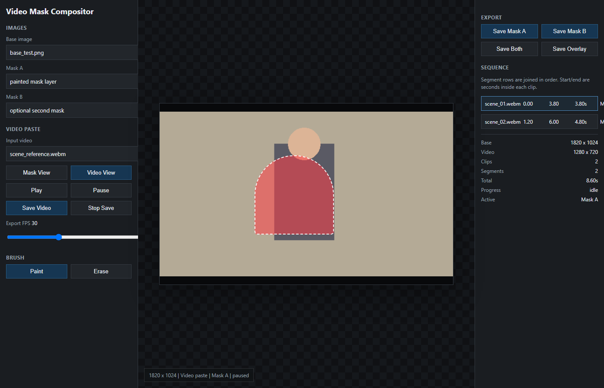
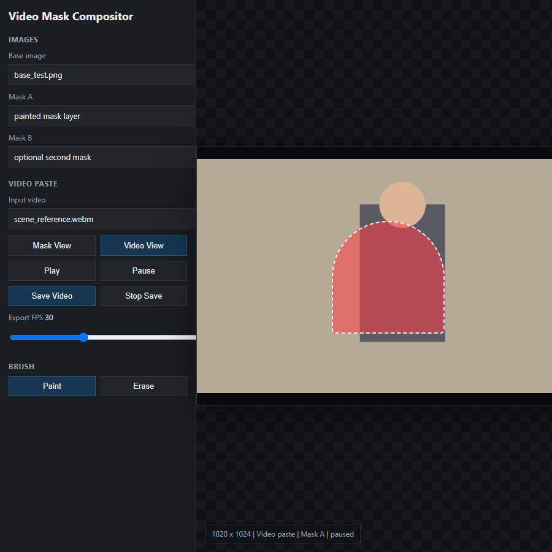

# Video Mask Compositor

A small browser tool for a very specific AI art/video workflow.

There are a lot of mask editors, video editors, and compositing tools already. This one exists because I needed something quick and direct for working with generated character art, inpainting masks, LoRAs, and image-to-video tests without opening a full editor every time.

The basic idea is simple:

- load a still image
- load or paint one or two masks
- preview masked regions over video
- keep editing masks while the video preview is actively playing
- export a composited WebM
- optionally join multiple clips with different masks over different time spans

It is not meant to replace a real NLE or image editor. It is meant to be the fast middle step between generated assets, ComfyUI experiments, inpainting tests, and training/reference cleanup.

## Quick Start

Use the hosted app here:

https://jaybuckley7.github.io/video-mask-compositor/

Open `index.html` in a browser.

No install step is required. Everything runs locally in the browser.

## Screenshots

Main workspace with mask preview and sequence controls:

Compact view focused on the masked still/video preview:

## What It Does

- Paint and erase two mask layers: `Mask A` and `Mask B`
- Load existing black/white mask images
- Move selected mask regions around
- Export mask layers as PNGs
- Export a visual mask overlay preview
- Load an input video and preview a still-image cutout pasted over it
- Paint, erase, and adjust masks while the video preview keeps playing
- Save the composited single-video result as WebM
- Build a simple clip sequence with per-segment:
  - clip
  - start time
  - end time
  - selected mask
- Save the full joined sequence as WebM

## Why It Exists

This was built for workflows like:

- preparing masks for AI inpainting
- checking whether a character still lines up against a video scene
- quickly testing whether a mask covers the right body/clothing/background region
- creating rough composited previews before sending frames into ComfyUI
- making lightweight reference material for LoRA or character-consistency experiments

It intentionally favors speed over polish.

## Notes

- Exports are WebM because browser-native canvas recording supports that reliably.
- Masks are static; they do not animate per frame.
- Mask edits are live in the preview, so you can paint or erase while playback is running.
- The video is scaled to the still image size during export.
- This works best when your still, mask, and source video are already aligned.
- If you need final production output, use this as a preview/helper step and finish in a real editor.

## Files

- `index.html` - the app
- `docs/screenshots/` - screenshots used by this README
